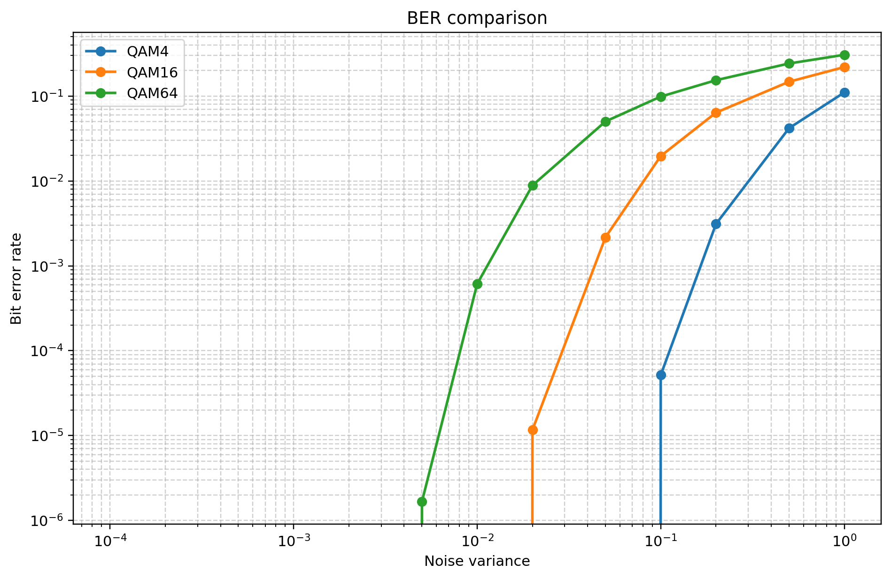

# qammodel

This project implements a simple QAM communication chain in C++ and provides Python script for plotting simulation results.

QAM modulator and demodulator implemented as template class with parameter K as a modulation level through a template `qam_config` class. It was done this way with an expection that no one ever will want to change modulation level in a runtime.

## Build

In order to build this project you need C++23 compatible compiler and CMake (3.10 and newer).

To build this project run:

```bash
cmake -S . -B build
cmake --build build
```

Now you have built executable in `build/` directory.

## Run Simulation

To run this simulation you have to run:

```bash
./build/qammodel
```

All simulation data will be saved in `data/` directory.

## Plot Results

In order to see plotted results you need to have Python installed with `matplotlib` and `pandas` as a dependency:

```bash
pip install matplotlib pandas
```

Run script with prefixes you need (currently available: `qam4`, `qam16`, `qam64`, if you need more, check out `src/main.cpp`):

```bash
python3 plots.py qam4 qam16 qam64
```

Generated plots are available by default in `plots/`.

## Example plot

After running both model and script you will get BER and constellation plots per QAM and a comparison plot:


